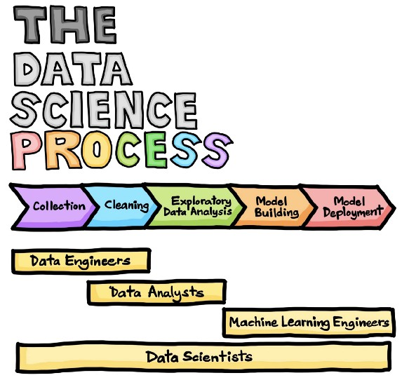

# Ultralearning Project: Data Science

Esse é meu primeiro projeto de ultralearning, encorajado e baseado em um [artigo](https://towardsdatascience.com/the-data-science-process-a19eb7ebc41b)(somado a esse [outro](https://towardsdatascience.com/data-science-learning-roadmap-for-2021-84f2ba09a44f)) que li no Towards Data Science, apesar do artigo falar sobre os PROCESSOS de Data Science, eu estou focando em aprender as HABILIDADES que realizam os processos. 

Assim como na imagem, o projeto é divido em três partes sendo cada parte a habilidade necessária para se tornar um Data Scienctist: 

1. Data Engineering
2. Data Analysis
3. Machine Learning Engineering

Obs.: Entedimento de Negócio também é uma habilidade necessária para se tornar um Data Scientist, e o estudo dela vai ser por fora do projeto. 

Em cada uma das pastas das partes tera um readme para dizer com objetividade o que ira ser estudado e os projetos a serem realizados. (meta-learning)
